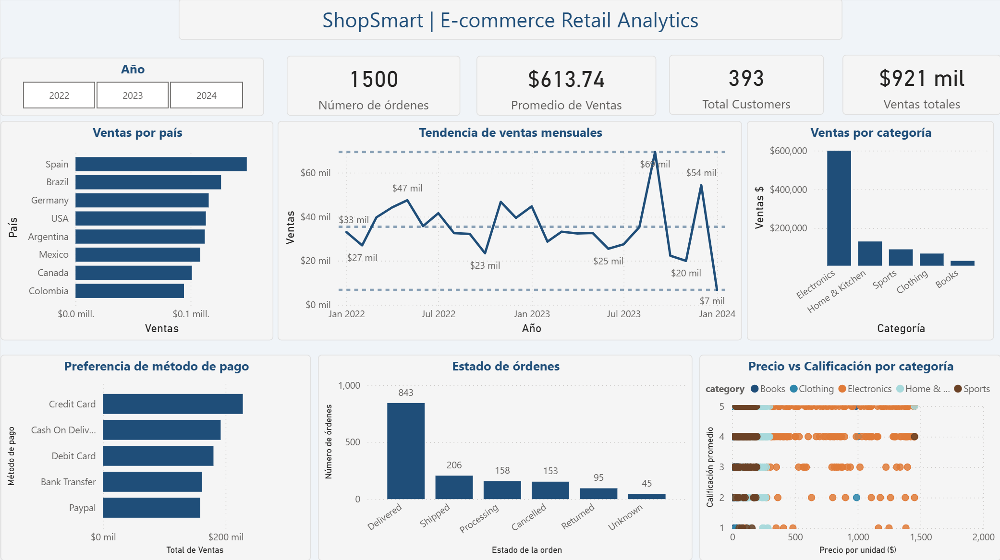

# 🛒 ShopSmart | E-Commerce Retail Analytics

> Complete data science pipeline applied to a retail e-commerce dataset.
> Built as a portfolio project covering the full workflow from raw data to ML predictions.

---

## 📋 Project Overview

**Company:** ShopSmart (simulated e-commerce retailer)  
**Period:** 2022–2023 | 1,500 orders | 8 countries  
**Role:** Junior Data Scientist  

---

## 🔧 Tools & Technologies

| Area | Tools |
|---|---|
| Data Cleaning & EDA | Python (pandas, numpy, matplotlib, seaborn) |
| Database | SQL (SQLite) |
| Feature Engineering | scikit-learn, numpy |
| Dashboard | Power BI |
| Machine Learning | scikit-learn (Random Forest, SMOTE) |
| Environment | Google Colab, VS Code |

---

## 📁 Project Structure
```
ShopSmart-Analytics/
├── data/          → Raw, clean, featured and model-ready datasets
├── notebooks/     → Jupyter notebooks for each phase
├── charts/        → EDA visualizations
├── dashboard/     → Power BI dashboard (.pbix)
└── README.md
```

---

## 🗂️ Pipeline Phases

| Phase | Description | Tool |
|---|---|---|
| 1 | Business Understanding | Documentation |
| 2 | Raw Data Exploration | Python + SQL |
| 3 | Data Cleaning | Python + SQL |
| 4 | Exploratory Data Analysis | Python |
| 5 | Feature Engineering & Normalization | Python (sklearn) |
| 6 | Dashboard | Power BI |
| 7 | Predictive Modeling | Python (sklearn) |
| 8 | Insights & Recommendations | Report |

---

## 📊 Dashboard Preview



---

## 🤖 Machine Learning Models

### Model 1 — Return Prediction (Classification)
- Algorithm: Random Forest Classifier
- Challenge: Class imbalance (6% returns) → solved with SMOTE
- Finding: No predictive signal in synthetic data — documented as limitation

### Model 2 — Rating Prediction (Regression)  
- Algorithm: Random Forest Regressor
- Finding: unit_price and age as top features (0.21, 0.17 importance)

### Model 3 — Sales Forecasting (Time Series)
- Algorithm: Random Forest with lag features
- Features: lag_1, lag_2, lag_3, rolling averages, cyclical encoding

---

## 💡 Key Insights

- **Electronics** generates 65% of total revenue but has the most volatile ratings
- **Spain and Brazil** are the top revenue-generating countries
- **Credit Card** is the preferred payment method (28% of orders)
- Revenue shows seasonal patterns with peaks in Q3 and Q4

---

## 👤 Author

**Carlos** — Industrial Engineer transitioning to Data Science  
📍 Colombia  
🔗 [LinkedIn](#)
```

---
